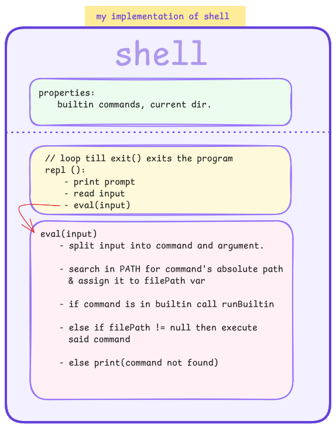

   <h1>Shell in Kotlin</h1>
   
Part of codecrafters' <b>Build your own Shell</b>

   
POSIX compliant-ish shell that's capable of running external programs and builtin
   commands like <code>cd</code>, <code>pwd</code>, <code>echo</code> and more.

   

