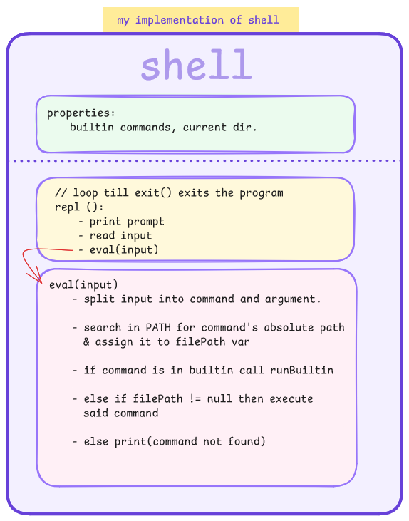

   <h1>Shell in Kotlin</h1>
   
Part of codecrafters' <b>Build your own Shell</b>

   
POSIX compliant shell that's capable of interpreting shell commands, running external programs and builtin
   commands like <code>cd</code>, <code>pwd</code>, <code>echo</code> and more.

   

## Status

### Completed

- Prompt printing.
- Missing command handling.
- REPL.
- Builtins: exit, echo, type (builtins & executable), pwd.
- program running.

### TODO

- Implement cd (relative, absolute, home)

- **Extra**: Output redirection, piping, history, job control, auto-completion, variable interpolation.

### Issues

1. only executables and implemented shell builtins are accepted.
2. doesn't properly parse windows' PATH
   (namely anything with `%<name>%`) as such only explicitly defined full path environment variables are supported.